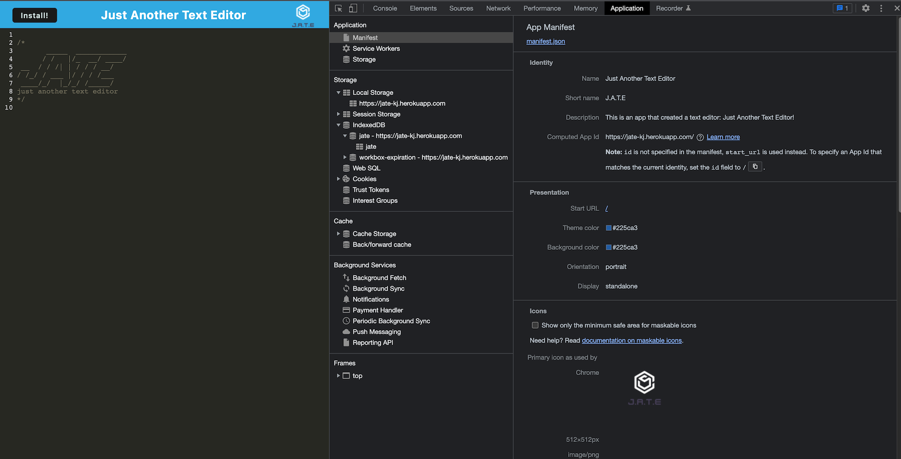
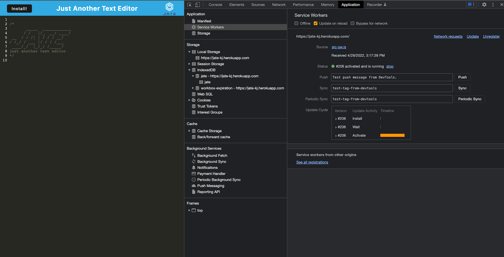
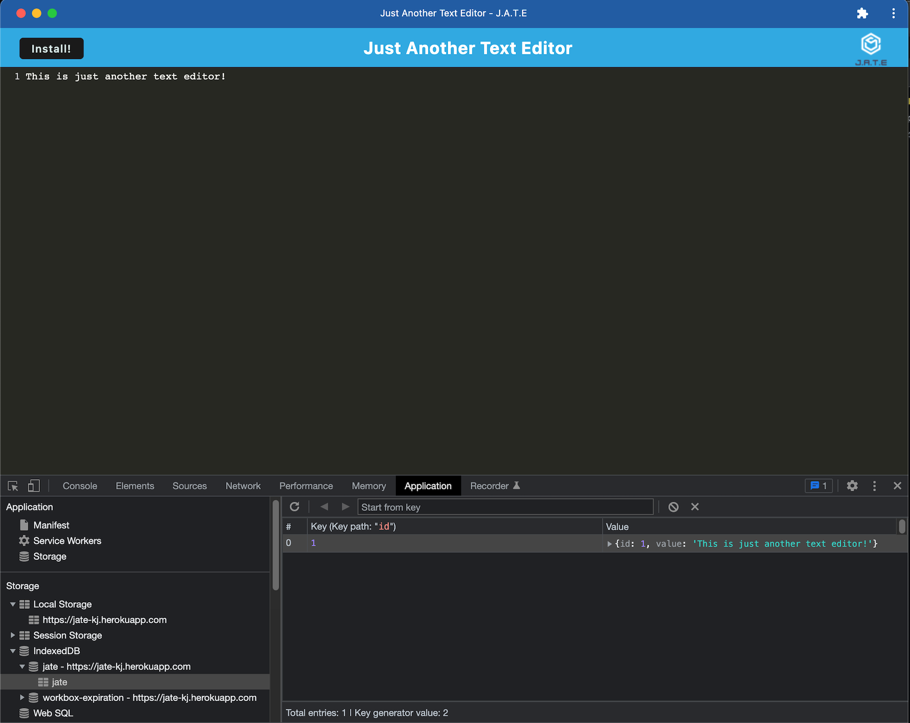

# NewGen-Text-Editor

------
## Table of Content

- [Description](#description)
- [Usage](#usage)
- [Mock-Up](#mock-Up)
- [Deployed Link](#deployed-link)
- [GitHub Repository](#github-repository)
- [Author](#author)  
- [Technologies Used](#technologies-used) 
- [License](#license)

------
## Description:  

This is a progressive web application. It is a text editor that runs in a browser.

------
## Usage:

Learn more about how to make use of this application by clicking on the source link that can be found further down on this page. Click the "install" button on the link, and then wait for the software to download to your computer. This will allow you to use the application even if you do not have an online connection.

------
## Mock-Up:

The following screnshot shows the application overview:

The following image shows the application's `manifest.json` file:  

The following image shows the application's registered `service worker`:  

The following image shows the application's `IndexedDB` storage:  

------

## Github Repository:

- [Github Repository for Text Editor](https://github.com/Lreyes4/NewGen-Text-Editor)

## Author:

- [Liliana Reyes](https://github.com/Lreyes4)

## Technologies Used:

## License:

